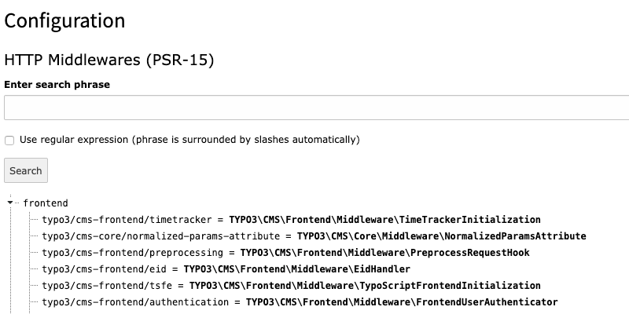

name: begin
class: center, middle, h1-fullwidth
background-image: url(../../images/TYPO3Logo.svg)

# TYPO3 Integrator Training

---
name: agenda
class: h1-fullwidth
# Agenda

* [Introduction](#introduction)
* [Prerequirements](#prerequirements)
* [Getting Help](#gettinghelp)
* [Installation](#installation)
* [Performance](#performance)
* [Backend Administration](#backend-administration)
* [Core Architecture & APIs](#core)
* [TypoScript](#typoscript)
* [Templating & other outputs](#templating)
* [Extensions](#extensions)
* [Security](#security)
---
name: introduction
class: center, middle, h1-fullwidth
layout: false

# Introduction
---
name: about
class: h1-fullwidth
# About the TYPO3 Certification

* The goal is to ensure the quality of TYPO3 CMS applications and websites remains at a high level

--

* TYPO3 is one of the first Open Source CMS with a Certification (since 2008)
---
name: reason
class: h1-fullwidth
# What is the reason for the Certification?

* TYPO3 CMS has become a major player in the market

--

* The expectation of the customers have increased

--

* With the success of TYPO3, the underlying complexity has grown

--

* Therefore, a successful project also requires extensive knowledge in the technologies of the CMS
---
name: important
class: h1-fullwidth
# The Certification is important for

* TYPO3 CMS Customers

???
* to assure the selected service supplier has the knowledge to implement a properly configured and successful TYPO3 solution.

--

* the TYPO3 CMS Project

???
* to show the market that there are lots of skilled specialists offering professional TYPO3 CMS services.

--

* TYPO3 CMS Professionals

???
* to train and test their skills and to present themselves as certified professionals to the market.

--

* YOU

???
* because you are an important part of our TYPO3 Community!
---
name: advantages
class: h1-fullwidth
# Advantages of the Certification

* Proof of knowledge and experience of a TYPO3 Integrator

--

* Own achievement of objectives (self esteem)

--

* Advantage at salary negotiations

--

* Criteria at „call for bids“

???
* german: öffentliche Ausschreibung

--

* Criteria for PSL (Professional Services Listing)
---
name: integrator
class: h1-fullwidth
# But what exactly is an „Integrator“?

The Education Team defines the "TYPO3 CMS Certified Integrator" as follows:

--

* The "TYPO3 CMS Certified Integrator" develops the template for a website, configures all the necessary extensions and creates the access rights for backend users.

--

* The "TYPO3 CMS Certified Integrator" does install TYPO3 on the webserver but does not program extensions.

--

* The "TYPO3 CMS Certified Integrator" knows how to configure the pre-installed TYPO3 using the installer.
---
name: costs
class: h1-fullwidth
# Testing costs

* The cost of the test are about 200 EUR

--

* If you are Association member, you will get 50 EUR discount
---
name: procedure
class: h1-fullwidth
# Procedure of certification

* Register to a certification event of your choice

???
* an online certification is in progress and should be available in summer 2020.

--

* Go to the event and run the exam

--

* After the exam, you'll get a notification via email if you have passend or not

--

* After about 4 weeks you will get a paper based certificate, if passed

---
name: checklist
class: h1-fullwidth
# Exam checklist

* Be prepared
    * Have you read the Syllabus?
    * Did you have a look at the example questions?
    * Did you have a very close look at the TSRef and TSConfig?

--

* Participant identification
    * Be prepared to show a photographic ID

???
Including a full name and signature. You will not be permitted to undertake the test if you fail to show acceptable forms of the ID. This will result in a forfeit of your test fee.

--

* Be there in time
    * Don't be late!

???
We ask that you arrive at the exam location 15 minutes before your scheduled appointment time. This will give you adequate time to complete the necessary sign-in procedures. If you arrive more than 15 minutes late for your appointment, you may be refused admission and exam fees may be forfeited.
---
name: checklist2
class: h1-fullwidth
# Exam checklist
* Language
    * Please be aware: The exam will be in English only.

???
If you typically work with a backend in a different language please have a closer look at the English one as well to make sure you understand the technical terms in the exam questions.

--

* Resources & cheat sheets
    * You do not have to bring anything (aside from a valid ID - see above) for the test!
    * You will not be allowed to use anything but your brain to pass the test.

???
So do not bring your laptop, your colleagues or any cheat sheet with you.

---
name: checklist3
class: h1-fullwidth
# Exam checklist

* NDA
    * Before you can start the exam you will have to agree to the NDA.
    * Take your time to read it carefully.
    * This agreement is created to protect the certification.

???
You do not have to bring the signed NDA to the certification - we will provide the NDA and you can sign it before taking the exam.
By adhering to this agreement (that is, keeping questions, answers and other information related to the certification exam confidential and by ensuring that the certification banners are used only by you), you help maintain the integrity of TYPO3 certification program.

--

* Sign off / Cancellation
    * It is not possible to cancel a registration
    * It is allowed to send an other person

???
You can send an other person to the exam, if you are prevented. In this case, you have to inform the education team and wait for a confirmation.
Not showing up at the date you registered or signing off within this period will be treated as if you did not pass. You also will be charged the full amount of the certification fee.
---
name: procedure
class: h1-fullwidth
# Procedure of the exam

* 75 questions to answer in 90 minutes

--

* The certification language is english only

--

* There are „Multiple Choice“ questions only

--

* There is a hint, how many answers are correct

--

* One question is answered correctly, if all answers are correctly checked

--

* No tools

--

* No questions

--

* No leaving of the room

--

* Rooms is guarded by a person
---
name: nda
class: h1-fullwidth
layout: false

# NDA - Non Disclosure Agreement

* The usage of the „Certified Integrator“ Banner is only allowed after a sucessfully certification

--

* All informations of the certification (especially questions and answers) must must remain confidential. This protects the test

--

* The Association has the Copyright of the Certification

--

* Violations result in the loss of certification

---
name: validity
class: h1-fullwidth
layout: false

# Validity of the exam

* The certificate is valid for 24 months from the issue date.

--

* Old TYPO3 version 4.5 certificates have been deprecated since the end of the official support for version 4.5 in March 2015. They have been obsolete since the end of the extended long term support (ELTS) of version 4.5 in March 2017.
---
name: notpassed
class: h1-fullwidth
layout: false

# Exam not passed

* If you have the feeling, that the assessment is wrong, feel free to contact the education committee.

--

* Someone will have a look at the exam manually and will confirm the result.

--

* You can take the exam as many times as you like, but after every failed attempt there will be a 3 months waiting period until you can try again.

--

* Until then: Learn, Learn, Learn! :-)
---
name: passed
class: h1-fullwidth
layout: false

# Exam passed

* Before using any certification logo or calling yourself a «TYPO3 CMS Certified Integrator», you will be required to pass the certification examination offered by the TYPO3 Association, and you must receive notice from the TYPO3 Association stating that:
    * you may use that particular certification banner and
    * you are allowed to call yourself «TYPO3 CMS Certified Integrator».
---
name: logo
class: h1-fullwidth
layout: false

# Certified Integrator logo

* If you are a freelancer or a one-person-company, you may integrate the logo in a global scope being generally visible (e.g: your website's footer or sidebar).

--

* If you are working for a company that has more than one employee, the logo must only be used where it is directly associated with the certified employees.
<br>For example: You may not use the logo on the homepage, or in the site footer, but you may use it on the employees bio or team-member page of the site should one exist.
---
name: difficulty
class: h1-fullwidth
layout: false

# How difficulty and cutscores for the exam are determined?

<br>
* The questions are coming randomly from a question pool.

--

* So you get a mixture of simple and difficult questions.

--

* The cutting score is 51. So you need at least 51 correct answered questions out of 75.
---
name: faq
class: h1-fullwidth
layout: false

# Scoring FAQ

* Do you inform me about the score I have reached in the exam?
<br>Yes

???
You get the score via email. It is not visible on the certificate.

--

* Am I granted access to the records?
<br>No, we cannot allow you to examine the files.

???
  First of all examining the exam will not help you in any way since we will not give you any information regarding which questions have been answered correctly or incorrectly.
  The administrative overhead would be far too large and we do not want to raise the price for the certification just because of a few curious people.
  In case of doubt we cross check the exams so the source of errors should be as low as ever possible.

---
name: objectives
class: h1-fullwidth
layout: false

# Objectives - Subject areas

* If not stated otherwise questions as of now refer to TYPO3 CMS version 10 LTS

--

* There are 10 Objectives (subject areas)
<br>These can change at anytime and/or an exam can contain less oder more questions from one objective

--

* It is important to know the differences between other TYPO3 versions, so get familiar with the „What’s new in TYPO3“ documents as well:
<br>[http://typo3.org/download/release-notes/whats-new/](http://typo3.org/download/release-notes/whats-new/)
---
name: notneed
class: h1-fullwidth
layout: false

# Objectives - What is NOT needed?

* Take a look at the registration page which TYPO3 version is used for the exam!
* Part of the exam are just system extensions (which are part of the release) but no other extension from the TER (TYPO3 Extension Repository)
<br>So, no mask, news, powermail, …
* Relevant are just these system extensions, which belong to the definition of an Integrator, so - no Extbase but Fluid!

---
name: prerequirements
class: center, middle, h1-fullwidth
layout: false

# Prerequirements
---
name: webskills
class: h1-fullwidth
# Web skills

* HTML
???
* you know HTML5 tags and understand semantic HTML
* you know what HTML-attributes are

--

* CSS
???
* you know how to include CSS in different ways
--

* Javascript
???
* you know how to include JS in different ways
* you know that there exist different javascript libraries

--

* SEO
???
* you know about meta tags
* you know what a XML sitemap is
* you know about speaking urls and redirects
* you know about important texts (page title, title attribute, …)
* you know index-enable, follow, robots.txt, canonical, hreflang

---
name: technicalskills
class: h1-fullwidth
# Technical skills

* Charsets

--

* Command line

--

* File permissions

--

* Image manipulation

--

* Webserver

--

* Regular expressions

--

* YAML

--

* Cron jobs

--

* HTTP status codes
---
name: gettinghelp
class: center, middle, h1-fullwidth
layout: false

# Getting Help
---
name: documentation
class: h1-fullwidth
# Getting help

* docs.typo3.org

--

* Slack

--

* Mailing lists

--

* Stackoverflow [typo3]
---
name: installation
class: center, middle, h1-fullwidth
layout: false

# Installation
---
name: installrequirements
class: h1-fullwidth
# Software components

* Webserver

--

* PHP (Versions, Modules, Settings)

--

* DBMS

--

* Image manipulation libraries

--

* Commandline commands

--

* Operating systems

--

* Webbrowsers
---
name: installways
class: h1-fullwidth
# Installation ways

* get.typo3.org
    * composer
    * from Git
---
name: installtypo3
class: h1-fullwidth
# TYPO3 Tools

* Step wizard

--

* Upgrade wizard

--

* Install tool

--

* TYPO3 console
---
name: performance
class: center, middle, h1-fullwidth
layout: false

# Performance
---
name: performancex
class: h1-fullwidth
# Performance

* Caching (Redis, Varnish)

--

* TYPO3 Caching

--

* HTTP headers

--

* compression / concatenating
---
name: backend-administration
class: center, middle, h1-fullwidth
layout: false

# Backend Administration
---
name: backend-administrationx
class: h1-fullwidth
# Backend Administration

* Site Configuration

--

* Workspaces

--

* Forms

--

* Import/Export

--

* User Rights/Access

--

* Rich text editor

--

* Reports Module

--

* Scheduler
---
name: core
class: center, middle, h1-fullwidth
layout: false

# Core Architecture & APIs
---
name: corex
class: h1-fullwidth
# Core Architecture & APIs

* FAL

--

* XLIFF

--

* Page title provider
---
name: typoscript
class: center, middle, h1-fullwidth
layout: false

# TypoScript
---
name: typoscriptx
class: h1-fullwidth
# TypoScript

* TypoScript functions (getText, stdWrap, …)

--

* Image Generation / Manipulation with TypoScript

--

* TypoScript Constants

--

* TypoScript Object Browser / Template Analyzer

--

* TypoScript Syntax & Basics & TLOs

--

* Page & User TSconfig

--

* TypoScript Objects and properties
---
name: templating
class: center, middle, h1-fullwidth
layout: false

# Templating & other outputs
---
name: templatingx
class: h1-fullwidth
# Templating & other outputs

* What is a Templating Engine?

--

* What is Fluid?

--

* ViewHelpers

--

* Importing ViewHelpers

--

* Templates, Layouts, Partials

--

* Using the Fluid View

--

* Fluid ViewHelpers

--

* Dataprocessors
---
name: extensions
class: center, middle, h1-fullwidth
layout: false

# Extensions
---
name: extensionsx
class: h1-fullwidth
# Extensions

* Extension Manager Basics

--

* Composer

--

* TER

--

* Plugins and Modules

--

* What is MVC?
---
name: security
class: center, middle, h1-fullwidth
layout: false

# Security
---
name: securityx
class: h1-fullwidth
# Security

* About the TYPO3 Security Team

???

* How to deal with security issues, both found and reported.

* How to contact security team

--

* Get informed about Security issues

???

* RSS Feed (https://typo3.org/help/security-advisories/)

* Mailing List (http://lists.typo3.org/cgi-bin/mailman/listinfo/typo3-announce)

* Extension Manager + Scheduler Tasks
  (Update extension manager list + send email on system report issues)

--

* Secure passwords

--

* Security inside TypoScript and Fluid

???

* Know https://docs.typo3.org/m/typo3/reference-coreapi/master/en-us/Security/GuidelinesIntegrators/Index.html

* SQL Injection (Intval)
  https://docs.typo3.org/m/typo3/reference-coreapi/master/en-us/Security/GuidelinesIntegrators/Index.html#sql-injection

* Cross Site Scripting (XSS)
  https://docs.typo3.org/m/typo3/reference-coreapi/master/en-us/Security/GuidelinesIntegrators/Index.html#cross-site-scripting-xss<Paste>

* External file inclusion
  https://docs.typo3.org/m/typo3/reference-coreapi/master/en-us/Security/GuidelinesIntegrators/Index.html#cross-site-scripting-xss

* Integrity of external JavaScript files
  https://docs.typo3.org/m/typo3/reference-coreapi/master/en-us/Security/GuidelinesIntegrators/Index.html#integrity-of-external-javascript-files

* Risk of externally hosted JavaScript libraries
  https://docs.typo3.org/m/typo3/reference-coreapi/master/en-us/Security/GuidelinesIntegrators/Index.html#risk-of-externally-hosted-javascript-libraries

* Raw HTML in content elements
  https://docs.typo3.org/m/typo3/reference-coreapi/master/en-us/Security/GuidelinesIntegrators/Index.html#content-elements

--

* Security headers & https

???

* Know differenct of http and https (SSL)

* Clickjacking (X-Frame-Options)
  https://docs.typo3.org/m/typo3/reference-coreapi/master/en-us/Security/GuidelinesIntegrators/Index.html#clickjacking

* Content Security Policy
  https://developer.mozilla.org/en-US/docs/Web/HTTP/Headers/Content-Security-Policy

--

* Global TYPO3 configuration options

???

See: https://docs.typo3.org/m/typo3/reference-coreapi/master/en-us/Security/GuidelinesIntegrators/Index.html#global-typo3-configuration-options

* trustedHostsPattern
* lockSSL
* displayErrors
* devIPmask
* cookieSecure
* warning_email_addr / warning_mode
* fileDenyPattern
* lockIP / lockIPv6, enabledBeUserIPLock, IPmaskList

--

* Backup strategy

???

* Have a way to automatically create backup of database and filesystem.
* Also have a way to restore data for filesystem and database.

---
name: work-help
class: center, middle, h1-fullwidth
layout: false

# Getting Help
---
name: work-install
class: center, middle, h1-fullwidth
layout: false

# Installation
---
name: work-perform
class: center, middle, h1-fullwidth
layout: false

# Performance
---
name: work-backend
class: center, middle, h1-fullwidth
layout: false

# Backend Administration
---
name: work-core
class: center, middle, h1-fullwidth
layout: false

# Core Architecture & APIs
---
name: work-typoscript
class: center, middle, h1-fullwidth
layout: false

# TypoScript
---
name: work-templating
class: center, middle, h1-fullwidth
layout: false

# Templating & other outputs
---
name: work-extensions
class: center, middle, h1-fullwidth
layout: false

# Extensions
---
name: work-security
class: center, middle, h1-fullwidth
layout: false

# Security

---
class: left, fullscreen-image pt-50
background-image: url(../../images/Benediktbeuern_1080p.png)

# Hallo schöne TYPO3 Welt!

## Lorem ipsum dolor sit amet, consectetur adipisicing elit. Aliquid animi aperiam aspernatur beatae blanditiis commodi deleniti dolores ducimus error ipsum iusto, obcaecati odio pariatur perspiciatis porro quasi quisquam reprehenderit suscipit.

---
class: right, fullscreen-image
background-image: url(../../images/Benediktbeuern_1080p.png)

# Hallo schöne TYPO3 Welt!

## Hier steht der Subheader …

---
name: TOC
class: h1-fullwidth
# TOC

1. [Introduction](#intro)

--

2. [PSR Standards](#PSR)

--

3. Test

--

4. Text

--

5. Text

--

6. Text

--

7. Text

---
name: intro
class: h1-fullwidth

# Introduction

---
name: PSR
class: center, middle, h1-fullwidth
layout: false

# PSR standards

???

## Links

* [https://www.php-fig.org/psr/]()
* [https://en.wikipedia.org/wiki/PHP_Standard_Recommendation]()

---
name: PSR-1
class: h1-fullwidth

# PSR-1

???

# PSR-1 - Basic Coding Standard

It comprises what should be considered the standard coding elements that are required to ensure a high level of technical interoperability between shared PHP code.

## Links

* [https://www.php-fig.org/psr/psr-1/]()

--

## Basic Coding Standard

---
name: PSR-2
class: h1-fullwidth

# PSR-2

???

# PSR-2 - Coding Style Guide

It considers PSR-1 and it is intended to reduce cognitive friction when scanning code from different authors. It does so by enumerating a shared set of rules and expectations about how to format PHP code.

## Links

* [https://www.php-fig.org/psr/psr-2/]()

--

## Coding Style Guide

--

```php
class Foo
{
    public function bar()
	{
	    // …
	}
}
```

---
name: PSR-3
class: h1-fullwidth

# PSR-3

???

# PSR-3 - Logger Interface

It describes a common interface for logging libraries.

PSR-3 was implemented in TYPO3 Version 9.

## Links

* [https://www.php-fig.org/psr/psr-3/]()

--

## Logger Interface

---
name: PSR-4
class: h1-fullwidth

# PSR-4

???

# PSR-4 - Autoloading Standard

It describes a specification for autoloading classes from file paths. It is fully interoperable, and can be used in addition to any other autoloading specification, including PSR-0. This PSR also describes where to place files that will be auto loaded according to the specification.

## Links

* [https://www.php-fig.org/psr/psr-4/]()

--

## Autoloading Standard

--

(Replaced PSR-0)

---
name: PSR-7
class: h1-fullwidth

# PSR-7

## HTTP Message Interface

???

# PSR-7 - HTTP Message Interface

It describes common interfaces for representing HTTP messages as described in RFC 7230 and RFC 7231, and URIs for use with HTTP messages as described in RFC 3986.

## Links

* [https://www.php-fig.org/psr/psr-7/]()
* [https://docs.typo3.org/c/typo3/cms-core/master/en-us/Changelog/9.2/Feature-83736-ExtendedPSR-7RequestsWithTYPO3ServerParameters.html]()

--

The PSR-7 request objects created by TYPO3 now contain an instance of NormalizedParams which can be used instead of `GeneralUtility::getIndpEnv()` to access normalized server params.

```php
/** @var NormalizedParams $normalizedParams */
$normalizedParams = $request->getAttribute('normalizedParams');
$requestPort = $normalizedParams->getRequestPort();
```

---
name: PSR-11
class: h1-fullwidth

# PSR-11

???

# PSR-11 - Container Interface

It describes a common interface for dependency injection containers. The goal is to standardize how frameworks and libraries make use of a container to obtain objects and parameters (called entries in the rest of this document).

## Links

* [https://www.php-fig.org/psr/psr-11/]()
* [https://forge.typo3.org/issues/83968]()

--

## Container Interface

---
name: PSR-12
class: h1-fullwidth

# PSR-12

???

# PSR-12 - Extended Coding Style Guide

It extends, expands and replaces [PSR-2](#PSR-2), the coding style guide and requires adherence to [PSR-1](#PSR-1), the basic coding standard.

## Links

* [https://www.php-fig.org/psr/psr-12/]()

--

## Extended Coding Style Guide

--
```
<?php

declare(strict_types=1);

namespace Vendor\Package;

use Vendor\Package\{ClassA as A, ClassB, ClassC as C};
use Vendor\Package\SomeNamespace\ClassD as D;

use function Vendor\Package\{functionA, functionB, functionC};

use const Vendor\Package\{ConstantA, ConstantB, ConstantC};

class Foo extends Bar implements FooInterface
{
    public function sampleFunction(int $a, int $b = null): array
    {
        //…
```

---
name: PSR-14
class: h1-fullwidth

# PSR-14

???

# PSR-14 - Event Manager

It describes common interfaces for dispatching and handling events.

## Links:

* [https://www.php-fig.org/psr/psr-14/]()
* [https://docs.typo3.org/c/typo3/cms-core/master/en-us/Changelog/10.0/Feature-88770-PSR-14BasedEventDispatcher.html]()

--

## Event Manager

---
name: PSR-15
class: h1-fullwidth

# PSR-15

???
#PSR-15 - HTTP Server Request Handlers

It describes common interfaces for HTTP server request handlers and HTTP server middleware components that use HTTP messages.

## Links:

* [https://www.php-fig.org/psr/psr-15/]()

--

## HTTP Server Request Handlers

--

.center[]

---
name: PSR-17
class: h1-fullwidth

# PSR-17

???

# PSR-17 - HTTP Factories 

It describes a common standard for factories that create PSR-7 compliant HTTP objects.

## Links

* [https://www.php-fig.org/psr/psr-17/]()
* [https://forge.typo3.org/issues/89018]()

--

## HTTP Factories

---
name: End
class: center, middle
count: false

.footnote[.red.bold[*]
Important footnote]

# End
